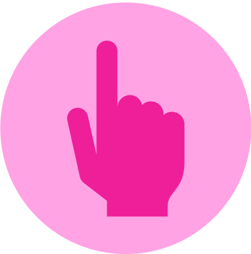

<!-- PROJECT LOGO -->
 

  

<h3 align="center">Button Bop</h3>

  

    Bop the Buttons from Lowest to Highest!
     
    <a href="https://github.com/catonbrewster1/ButtonMatching"><strong>Explore the docs »</strong></a>
     
     
    <a href="https://github.com/catonbrewster1/ButtonMatching">View Demo</a>
    ·
    <a href="https://github.com/catonbrewster1/ButtonMatching/issues">Report Bug</a>
    ·
    <a href="https://github.com/catonbrewster1/ButtonMatching/issues">Request Feature</a>
  

<!-- TABLE OF CONTENTS -->

  
Table of Contents

  <ol>
    <li>
      <a href="#about-the-game">About The Game</a>
      <ul>
        <li><a href="#built-with">Built With</a></li>
      </ul>
    </li>
    <li>
      <a href="#getting-started">Getting Started</a>
    </li>
    <li><a href="#features">Usage</a></li>
    <li><a href="#contact">Contact</a></li>
  </ol>

<!-- ABOUT THE GAME -->
## About The Game

Button Bop is a game where the user's goal is to click all of the buttons shown from lowest value to highest value as quickly as possible. 

Upon opening the app, the user sees the following screen: 

After clicking "CLICK TO START GAME", the user will see a new board of 24 buttons, each displaying a random number between 1 and 100, inclusive. A timer in the top left-hand corner will start ticking immediately. A "Quit Game" button will appear in the top right-hand corner which they can click any time to exit the game return to the start screen above. 

The goal is to click the buttons from smallest value to largest value as quickly as possible. If an incorrect button is pressed, it will blink and remain on the screen. If the correct button is clicked, it will disappear: 

Upon successfully clicking all the buttons, an alert will inform the user of their final time:

There is a time limit of 10 minutes, after which an alert will notify the user "Time's up!"

(<a href="#top">back to top</a>)

### Built With

* [Kotlin]([https://nextjs.org/](https://kotlinlang.org/docs/home.html))
* Android Studio

(<a href="#top">back to top</a>)

<!-- GETTING STARTED -->
## Getting Started

***To Run App**: Clone the repo, open in Android Studio, ensure you have an emulator running, put the cursor in the editor window, press Ctrl + R to run.
***To Run Tests**: Clone the repo, open in Android Studio, select the app/src/test directory, press Ctrl + R to run.

(<a href="#top">back to top</a>)

<!-- FEATURES -->
## Features

Use this space to show useful examples of how a project can be used. Additional screenshots, code examples and demos work well in this space. You may also link to more resources.

_For more examples, please refer to the [Documentation](https://example.com)_

(<a href="#top">back to top</a>)

<!-- CONTACT -->
## Contact

Caton Brewster - catonbrewster@gmail.com

(<a href="#top">back to top</a>)

<!-- MARKDOWN LINKS & IMAGES -->
<!-- https://www.markdownguide.org/basic-syntax/#reference-style-links -->
[contributors-shield]: https://img.shields.io/github/contributors/github_username/repo_name.svg?style=for-the-badge
[contributors-url]: https://github.com/github_username/repo_name/graphs/contributors
[forks-shield]: https://img.shields.io/github/forks/github_username/repo_name.svg?style=for-the-badge
[forks-url]: https://github.com/github_username/repo_name/network/members
[stars-shield]: https://img.shields.io/github/stars/github_username/repo_name.svg?style=for-the-badge
[stars-url]: https://github.com/github_username/repo_name/stargazers
[issues-shield]: https://img.shields.io/github/issues/github_username/repo_name.svg?style=for-the-badge
[issues-url]: https://github.com/github_username/repo_name/issues
[license-shield]: https://img.shields.io/github/license/github_username/repo_name.svg?style=for-the-badge
[license-url]: https://github.com/github_username/repo_name/blob/master/LICENSE.txt
[linkedin-shield]: https://img.shields.io/badge/-LinkedIn-black.svg?style=for-the-badge&logo=linkedin&colorB=555
[linkedin-url]: https://linkedin.com/in/linkedin_username
[product-screenshot]: images/screenshot.png
